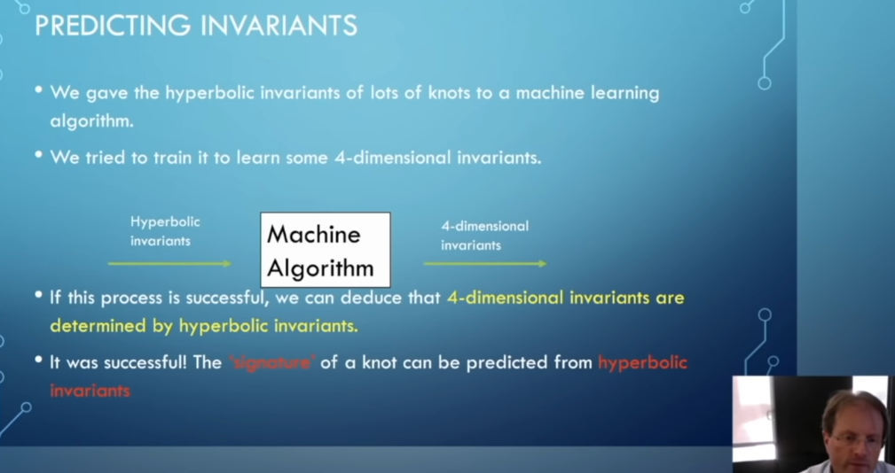

# Deep Learning Theory
整理了一些深度学习的理论相关内容，持续更新。
## Overview
1. [Recent advances in deep learning theory](https://arxiv.org/pdf/2012.10931.pdf)
总结了目前深度学习理论研究的六个方向的一些结果，概述型，没做深入探讨(2021)。

    + 1.1 complexity and capacity-basedapproaches for analyzing the generalizability of deep learning; 

    + 1.2 stochastic differential equations andtheir dynamic systems for modelling stochastic gradient descent and its variants, which characterizethe optimization and generalization of deep learning, partially inspired by Bayesian inference; 

    + 1.3 thegeometrical structures of the loss landscape that drives the trajectories of the dynamic systems;

    + 1.4 theroles of over-parameterization of deep neural networks from both positive and negative perspectives; 

    + 1.5 theoretical foundations of several special structures in network architectures; 

    + 1.6 the increasinglyintensive concerns in ethics and security and their relationships with generalizability
2. 🔥 [On the Principles of Parsimony and Self-Consistency for the Emergence of Intelligence](https://arxiv.org/abs/2207.04630)(2022.7.马毅、沈向洋、曹颖)"任何一个智能系统，作为一个看似简单的自主闭环：信息、控制、对策、优化、神经网络，紧密结合，缺一不可。总而言之，人工智能的研究从现在开始，应该能够也必须与科学、数学、和计算紧密结合。从最根本、最基础的第一性原理（简约、自洽）出发，把基于经验的归纳方法与基于基础原理的演绎方法严格地、系统地结合起来发展。理论与实践紧密结合、相辅相成、共同推进我们对智能的理解。" 知乎解读可看：https://zhuanlan.zhihu.com/p/543041107 。
3. [Machine Learning in Physics and Geometry](https://arxiv.org/abs/2303.12626)(2023.3)总结了ml在几何和理论物理上的一些进展，主要涉及到pca,t-sne,k-means,nn,svm，数据拓扑分析技术内容，理论物理包含了Polytopes，Amoebae，Quivers，Brane Webs。

## Course
2. [Theory of Deep Learning](https://www.ideal.northwestern.edu/special-quarters/fall-2020/)TTIC,西北大学等组织的一系列课程和讲座，基础课程涉及DL的基础(符号化，简化后的数学问题和结论)，信息论和学习，统计和计算，信息论，统计学习和强化学习(2020)。

2+. [2021 Deep learning theory lecture note](https://mjt.cs.illinois.edu/dlt/ )
    + 2.1 逼近，优化，通用性，三方面做了总结，核心内容网页可见，比较友好。

3. [MathsDL-spring19](https://joanbruna.github.io/MathsDL-spring19/),MathDL系列，18,19,20年均有。

    + 3.1  Geometry of Data

        + Euclidean Geometry: transportation metrics, CNNs , scattering.
        + Non-Euclidean Geometry: Graph Neural Networks.
        + Unsupervised Learning under Geometric Priors (Implicit vs explicit models, microcanonical, transportation metrics).
        + Applications and Open Problems: adversarial examples, graph inference, inverse problems.

    + 3.2 Geometry of Optimization and Generalization

        + Stochastic Optimization (Robbins & Munro, Convergence of SGD)
        + Stochastic Differential Equations (Fokker-Plank, Gradient Flow, Langevin + + Dynamics, links with SGD; open problems)
        Dynamics of Neural Network Optimization (Mean Field Models using Optimal Transport, Kernel Methods)
        + Landscape of Deep Learning Optimization (Tensor/Matrix factorization, Deep Nets; open problems).
        + Generalization in Deep Learning.

    + 3.3  Open qustions on Reinforcement Learning
4. [IFT 6169: Theoretical principles for deep learning](http://mitliagkas.github.io/ift6085-dl-theory-class/)(2022 Winter),大多内容较为基础，传统。
    + 4.1 拟定课题
        + Generalization: theoretical analysis and practical bounds
        + Information theory and its applications in ML (information bottleneck, lower bounds etc.)
        +  Generative models beyond the pretty pictures: a tool for traversing the data manifold, projections, completion, substitutions etc.
        + Taming adversarial objectives: Wasserstein GANs, regularization approaches and + controlling the dynamics
        + The expressive power of deep networks (deep information propagation, mean-field analysis of random networks etc.)
5. [深度学习几何课程](https://geometricdeeplearning.com/lectures/)(2022, Michael Bronstein)内容比较高级.
    + 5.1 2022 年的 GDL100 共包含 12 节常规课程、3 节辅导课程和 5 次专题研讨。12 节常规课程主要介绍了几何深度学习的基本概念知识，包括高维学习、几何先验知识、图与集合、网格（grid）、群、测地线（geodesic）、流形（manifold）、规范（gauge）等。3 节辅导课主要面向表达型图神经网络、群等变神经网络和几何图神经网络。

    + 5 次专题研讨的话题分别是：
        1. 从多粒子动力学和梯度流的角度分析神经网络；
        2. 表达能力更强的 GNN 子图；
        3. 机器学习中的等变性；
        4. 神经 sheaf 扩散：从拓扑的角度分析 GNN 中的异质性和过度平滑；
        5. 使用 AlphaFold 进行高度准确的蛋白质结构预测。

6. [Advanced Topics in Machine Learning and Game Theory](https://feifang.info/advanced-topics-in-machine-learning-and-game-theory-fall-2022/)游戏，强化方面的课程，2022。
## Architecture
5. [Partial Differential Equations is All You Need for Generating Neural Architectures -- A Theory for Physical Artificial Intelligence Systems](https://arxiv.org/abs/2103.08313) 将统计物理的反应扩散方程，量子力学中的薛定谔方程，傍轴光学中的亥姆霍兹方程统一整合到神经网络偏微分方程中(NPDE)，利用有限元方法找到数值解，从离散过程中，构造了多层感知，卷积网络，和循环网络，并提供了优化方法L-BFGS等，主要是建立了经典物理模型和经典神经网络的联系(2021)。

## Approximation
6. NN Approximation Theory
    + 6.0 [Universal approximation theorem](https://en.wikipedia.org/wiki/Universal_approximation_theorem)NN逼近从这里开始(1991)
    + 6.1 [Cybenko’s Theorem and the capabilityof a neural networkas function approximator](https://www.mathematik.uni-wuerzburg.de/fileadmin/10040900/2019/Seminar__Artificial_Neural_Network__24_9__.pdf)一二维shallow神经网络的可视化证明(2019)
    + 6.2 [Depth Separation for Neural Networks](https://arxiv.org/abs/1702.08489) 三层神经网络的表示能力比两层有优越性的简化证明 (2017)
    + 6.3 [赵拓等三篇](https://www.zhihu.com/question/347654789/answer/1480974642)(2019)
    + 6.4 [Neural Networks with Small Weights and Depth-Separation Barriers](https://arxiv.org/abs/2006.00625) Gal Vardi等证明了对某些类型的神经网络, 用k层的多项式规模网络需要任意weight, 但用3k+3层的多项式规模网络只需要多项式大小的 weight(2020)。
    + 6.5 [Universality of Deep Convolutional Neural Networks](https://arxiv.org/pdf/1805.10769.pdf)卷积网络的通用逼近能力，及其核心要素，Ding-Xuan Zhou(2018)，20年发表。
    + 6.6 [Deep Learning and Approximation theory 2023](https://nadavdym.github.io/lecture_notes/DeepNotes.pdf ) 关于DL和逼近理论的notes，62页，比较清晰完善。 

## Optimization
7. SGD
    + 7.1 [nesterov-accelerated-gradient](https://paperswithcode.com/method/nesterov-accelerated-gradient)

8. [offconvex](http://www.offconvex.org/)几个学术工作者维护的AI博客。
    + 8.1 [beyondNTK](http://www.offconvex.org/2021/03/25/beyondNTK/) 什么时候NN强于NTK？
    + 8.2 [instahide](http://www.offconvex.org/2020/11/11/instahide/) 如何在不泄露数据的情况下优化模型？
    + 8.3 [implicit regularization in DL explained by norms?](http://www.offconvex.org/2020/11/27/reg_dl_not_norm/)

9. [Adam](https://arxiv.org/abs/1412.6980)
    + 9.1 [deep-learning-dynamics-paper-list](https://github.com/zeke-xie/deep-learning-dynamics-paper-list)关于DL优化动力学方面研究的资料收集。
    + 9.2 [Adai](https://github.com/zeke-xie/adaptive-inertia-adai) Adam的优化版本Adai，Adam逃离鞍点很快，但是不能像SGD一样擅长找到flat minima。作者设计一类新的自适应优化器Adai结合SGD和Adam的优点。Adai逃离鞍点速度接近Adam,寻找flat minima能接近SGD。其知乎介绍可看[Adai-zhihu]((https://www.zhihu.com/question/323747423/answer/2576604040))
10. [ Smooth momentum: improving lipschitzness in gradient descent ](https://link.springer.com/article/10.1007/s10489-022-04207-7) 提出了平滑动量，一种新的优化器，它改善了在”陡峭墙壁”上的行为。作者对所提出的优化器的特性进行了数学分析，并证明了平滑动量展现出改进的利普希茨特性和收敛性，这允许在梯度下降中稳定且更快的收敛。 (2023)

## Geometry
9. Optima transmission
    + 9.1 [深度学习的几何学解释](http://www.engineering.org.cn/ch/10.1016/j.eng.2019.09.010)(2020)

## Book
10. [Theory of Deep Learning(draft)](https://www.cs.princeton.edu/courses/archive/fall19/cos597B/lecnotes/bookdraft.pdf)Rong Ge 等(2019)。

11. [Spectral Learning on Matrices and Tensors](https://arxiv.org/pdf/2004.07984.pdf)Majid Janzamin等(2020)

19. [Deep Learning Architectures A Mathematical Approach](https://www.springer.com/gp/book/9783030367206)(2020),你可以libgen获取，内容如其名字,大概包含：工业问题，DL基础(激活，结构，优化等),函数逼近，万有逼近，RELU等逼近新研究，函数表示，以及两大方向，信息角度，几何角度等相关知识，实际场景中的卷积，池化，循环，生成，随机网络等具体实用内容的数学化，另外附录集合论，测度论，概率论，泛函，实分析等基础知识。
20. [The Principles of Deep Learning Theory](https://arxiv.org/pdf/2106.10165.pdf)(2021)Daniel A. Roberts and Sho Yaida(mit)，Beginning from a first-principles component-level picture of networks，本书解释了如何通过求解层到层迭代方程和非线性学习动力学来确定训练网络输出的准确描述。一个主要的结果是网络的预测是由近高斯分布描述的，网络的深度与宽度的纵横比控制着与无限宽度高斯描述的偏差。本书解释了这些有效深度网络如何从训练中学习非平凡的表示，并更广泛地分析非线性模型的表示学习机制。从近内核方法的角度来看，发现这些模型的预测对底层学习算法的依赖可以用一种简单而通用的方式来表达。为了获得这些结果，作者开发了表示组流（RG 流）的概念来表征信号通过网络的传播。通过将网络调整到临界状态，他们为梯度爆炸和消失问题提供了一个实用的解决方案。作者进一步解释了 RG 流如何导致近乎普遍的行为，从而可以将由不同激活函数构建的网络做类别划分。Altogether, they show that the depth-to-width ratio governs the effective model complexity of the ensemble of trained networks。利用信息理论，作者估计了模型性能最好的最佳深宽比，并证明了残差连接能将深度推向任意深度。利用以上理论工具，就可以更加细致的研究架构的归纳偏差，超参数，优化。[原作者的视频说明](https://www.youtube.com/watch?v=wXZKoHEzASg)(2021.12.1)
21. [Physics-based Deep Learning](https://arxiv.org/pdf/2109.05237.pdf)(2021)N. Thuerey, P. Holl,etc.[github resources](https://github.com/thunil/Physics-Based-Deep-Learning)深度学习与物理学的联系。比如基于物理的损失函数，可微流体模拟，逆问题的求解，Navier-Stokes方程的前向模拟，Controlling Burgers’ Equation和强化学习的关系等。
22. [Geometric Deep Learning: Grids, Groups, Graphs, Geodesics, and Gauges](https://arxiv.org/abs/2104.13478)(Michael M. Bronstein, Joan Bruna, Taco Cohen, Petar Veličković,2021),见上面课程5:深度学习几何课程.
23. [dynamical systems and ml 2, 2020](https://www.stat.berkeley.edu/~mmahoney/talks/dynamical_systems_and_ml_2.pdf)看起来写得很好，有Connection between ResNets and Dynamical Systems。
24. [Dynamical Systems and Machine Learning 2020, pku](https://www.math.pku.edu.cn/amel/docs/20200719122925684287.pdf)。

## Session
21. [Foundations of Deep Learning](https://simons.berkeley.edu/programs/dl2019)(2019)，西蒙研究中心会议。
22. [Deep Learning Theory 4](https://icml.cc/virtual/2021/session/12048)(2021, ICML)Claire Monteleoni主持...,深度学习理论会议4，包含论文和视频。
23. [Deep Learning Theory 5 ](https://icml.cc/virtual/2021/session/12057)(2021,ICML)MaYi主持...，深度学习理论会议5，包含论文和视频。
24. [DeLTA 2023 : 4th International Conference on Deep Learning Theory and Applications](http://www.wikicfp.com/cfp/servlet/event.showcfp?eventid=170637&copyownerid=45217) 会议包含RNN,CNN,DHN,GAN,AE,EV,Dimensionality Reduction等基本模型内容，具体啥内容未知，ML的基本内容，强化，度量，核，图表示，聚类，分类，回归等，还有大数据，图像的具体应用方向，语言理解方向。看起来都是比较基础内容。
25. [和动力系统的会议 2023](https://machinelearning-dynamic.github.io/)。[里面收到的文章列表](https://machinelearning-dynamic.github.io/schedule.html )

## generalization
1. [Robust Learning with Jacobian Regularization](https://arxiv.org/abs/1908.02729)(2019)Judy Hoffman..., 
2. [Predicting Generalization using GANs](http://www.offconvex.org/2022/06/06/PGDL/)(2022.6),用GAN来评估泛化性.
3. [Implicit Regularization in Tensor Factorization: Can Tensor Rank Shed Light on Generalization in Deep Learning?](http://www.offconvex.org/2021/07/08/imp-reg-tf/)(2021.7)Tensor Rank 能否揭示深度学习中的泛化？
4. [如何通过Meta Learning实现域泛化Domain Generalization](https://mp.weixin.qq.com/s/o1liWf9B4_LntBeyV2bVOg)(2022.4),[Domain Generalization CVPR2022](https://mp.weixin.qq.com/s/HkjHEqs8d85VPdgpaHEzPQ)博文参考.
5. [Generalization-Causality](https://github.com/yfzhang114/Generalization-Causality) 一博士关于domain generalization等工作的实时汇总。
6. [Implicit Regularization in Hierarchical Tensor Factorization and Deep Convolutional Networks](http://www.offconvex.org/2022/07/15/imp-reg-htf-cnn/)(Noam Razin  •  Jul 15, 2022)

    + 6.1 Across three different neural network types (equivalent to matrix, tensor, and hierarchical tensor factorizations), we have an architecture-dependant notion of rank that is implicitly lowered. Moreover, the underlying mechanism for this implicit regularization is identical in all cases. This leads us to believe that implicit regularization towards low rank may be a general phenomenon. If true, finding notions of rank lowered for different architectures can facilitate an understanding of generalization in deep learning.

    + 6.2 Our findings imply that the tendency of modern convolutional networks towards locality may largely be due to implicit regularization, and not an inherent limitation of expressive power as often believed. More broadly, they showcase that deep learning architectures considered suboptimal for certain tasks can be greatly improved through a right choice of explicit regularization. Theoretical understanding of implicit regularization may be key to discovering such regularizers.

## Others
4. [Theoretical issues in deep networks](https://www.pnas.org/content/117/48/30039) 表明指数型损失函数中存在隐式的正则化，其优化的结果和一般损失函数优化结果一致，优化收敛结果和梯度流的迹有关，目前还不能证明哪个结果最优(2020)。
12. [The Dawning of a New Erain Applied Mathematics](https://www.ams.org/journals/notices/202104/rnoti-p565.pdf)Weinan E关于在DL的新处境下结合历史的工作范式给出的指导性总结(2021)。
13. [Mathematics of deep learning from Newton Institute](https://www.newton.ac.uk/event/mdl)。
14. [DEEP NETWORKS FROM THE PRINCIPLE OF RATE REDUCTION](https://openreview.net/forum?id=G70Z8ds32C9)，白盒神经网络。
15. [redunet_paper](https://github.com/ryanchankh/redunet_paper)白盒神经网络代码。
16. [Theory of Deep Convolutional Neural Networks:Downsampling](https://www.cityu.edu.hk/rcms/pdf/XDZhou/dxZhou2020b.pdf)下采样的数学分析Ding-Xuan Zhou(2020)
17. [Theory of deep convolutional neural networks II: Spherical analysis](https://arxiv.org/abs/2007.14285)还有III：radial functions 逼近，(2020)。不过这些工作到底如何，只是用数学转换了一下，理论上没做过多贡献，或者和实际结合没难么紧密，还不得而知。
18. [The Modern Mathematics of Deep Learning](https://arxiv.org/abs/2105.04026)(2021)主要是deep laerning的数学分析描述，涉及的问题包括：超参数网络的通用能力，深度在深度模型中的核心作用，深度学习对维度灾难的克服，优化在非凸优化问题的成功，学习的表示特征的数学分析，为何深度模型在物理问题上有超常表现，模型架构中的哪些因素以何种方式影响不同任务的学习中的不同方面。
19. [Topos and Stacks of Deep Neural Networks](https://arxiv.org/abs/2106.14587)(2021)每一个已知的深度神经网络(DNN)对应于一个典型的 Grothendieck 的 topos 中的一个对象; 它的学习动态对应于这个 topos 中的一个态射流。层中的不变性结构(如 CNNs 或 LSTMs)与Giraud's stacks相对应。这种不变性被认为是泛化性质的原因，即从约束条件下的学习数据进行推断。纤维代表前语义类别(Culioli，Thom) ，其上人工语言的定义，内部逻辑，直觉主义，经典或线性(Girard)。网络的语义功能是用这种语言表达理论的能力，用于回答输入数据输出中的问题。语义信息的量和空间的定义与香农熵的同源解释相类似。他们推广了 Carnap 和 Bar-Hillel (1952)所发现的度量。令人惊讶的是，上述语义结构被分类为几何纤维对象在一个封闭的Quillen模型范畴，然后他们引起同时局部不变的 dnn 和他们的语义功能。Intentional type theories (Martin-Loef)组织这些对象和它们之间的纤维化。信息内容和交换由 Grothendieck's derivators分析。
20. [Visualizing the Emergence of Intermediate Visual Patterns in DNNs](https://arxiv.org/abs/2111.03505)(2021,NIPS)文章设计了一种神经网络中层特征的可视化方法，使得能
（1）更直观地分析神经网络中层特征的表达能力，并且展示中层特征表达能力的时空涌现；
（2）量化神经网络中层知识点，从而定量地分析神经网络中层特征的质量；
（3）为一些深度学习技术（如对抗攻击、知识蒸馏）提供新见解。
21.  [神经网络的博弈交互解释性](https://zhuanlan.zhihu.com/p/264871522/)(知乎)。上交大张拳石团队研究论文整理而得，作为博弈交互解释性的体系框架（不怎么稳固）。
22.  [Advancing mathematics by guiding human intuition with AI](https://www.nature.com/articles/s41586-021-04086-x)(2021,nature)机器学习和数学家工作的一个有机结合，主要利用机器学习分析众多特征和目标变量的主要相关因子，加强数学家的直觉，该论文得到了两个漂亮的定理，一个拓扑，一个表示论。可参考[回答](https://www.zhihu.com/question/503185412/answer/2256015652)。
23. 🔥[A New Perspective of Entropy](https://math3ma.institute/wp-content/uploads/2022/02/bradley_spring22.pdf)(2022) 通过莱布尼兹微分法则(Leibniz rule)将信息熵,抽象代数,拓
扑学联系起来。该文章是一个零基础可阅读的综述,具体参考[Entropy as a Topological Operad Derivation ](https://www.mdpi.com/1099-4300/23/9/1195)(2021.7,Tai-Danae Bradley.)
24. [minerva](https://storage.googleapis.com/minerva-paper/minerva_paper.pdf)(2022)google提出的解题模型,在公共高等数学等考试中比人类平均分高.[测试地址](https://minerva-demo.
github.io/#category=Algebra&index=1).
25. 🔥[An automatic theorem proving project](https://gowers.wordpress.com/2022/04/28/announcing-an-automatic-theorem-proving-project/#more-6531)菲尔兹获得者数学家高尔斯关于
自动证明数学定理的项目进展[How can it be feasible to find proofs?](https://drive.google.com/file/d/1-FFa6nMVg18m1zPtoAQrFalwpx2YaGK4/view)(2022, W.T. Gowers).
26. [GRAND: Graph Neural Diffusion ](https://papertalk.org/papertalks/32188)(2021)该网站包含了一些相似论文资料,[项目地址graph-neural-pde](https://github.com/twitter-research
/graph-neural-pde),其优化版本[GRAND++](https://openreview.net/forum?id=EMxu-dzvJk).(2022).有博文介绍[图神经网络的困境，用微分几何和代数拓扑解决](https://mp.weixin.qq.com/s/CFNvgn6vaYcI36QJNa3_dw)仅供参
考.
27. [Weinan È-A Mathematical Perspective on Machine Learning](https://opade.digital/)(2022.icm),room1最后一排,鄂维南在icm的演讲视频.
28.  [contrastive learning](https://zhuanlan.zhihu.com/p/524733769)证明包括InfoNCE在内的一大类对比学习目标函数，等价于一个有两类变量（或者说两类玩家）参与的交替优化（或者说游戏）过程.
29.  [可解释性：Batch Normalization未必客观地反应损失函数信息](https://zhuanlan.zhihu.com/p/523627298)2022,张拳石等.
30. [Homotopy Theoretic and Categorical Models of Neural Information Networks](https://arxiv.org/abs/2006.15136)该工作第一作者俄罗斯数学家Yuri Manin，2020工作，2022年8月arxiv有更新。[ncatlab有讨论](https://nforum.ncatlab.org/discussion/13133/understanding-preprint-topos-and-stacks-of-deep-neural-networks/)。[博文讲解](http://www.neverendingbooks.org/deep-learning-and-toposes)。
31. [Deep learning via dynamical systems: An approximation perspective](https://ems.press/journals/jems/articles/5404458)动力系统逼近。[论文见](https://cpb-us-w2.wpmucdn.com/blog.nus.edu.sg/dist/d/11132/files/2021/01/main-jems.pdf)。
32. [群论角度](https://www.youtube.com/playlist?list=PL8FnQMH2k7jzPrxqdYufoiYVHim8PyZWd)群论角度去理解的一系列视频，群论视角，2014年出现过，视频系统讲解，2022年。
33. [Constructions in combinatorics via neural networks](https://arxiv.org/abs/2104.14516)作者Adam Zsolt Wagner通过神经网络和强化学习构建了一系列反例，推翻了几个组合学的猜想，2021年。
34. [不动点2023](https://arxiv.org/pdf/2303.12814.pdf)这篇文章主要研究任意深度的一维神经网络中的固定点问题。首先，文章介绍了一种新的方法，通过代数拓扑理论来研究神经网络中的固定点。然后，文章证明了任意深度的一维神经网络在某些情况下一定存在固定点。特别地，当网络中的激活函数为sigmoid函数时，网络在存在足够多的神经元时必定存在固定点。此外，文章还证明了某些特殊情况下，任意深度的一维神经网络中的固定点是稠密的，即在网络参数的空间中，存在无限多的参数可以使得网络的输出为固定值。这项研究具有深入探究神经网络理论的意义，有助于深入理解神经网络在不同条件下的表现和性质。*后面内容是直接输入题目，chatgpt总结的。*
35. [Overparameterized ReLU Neural Networks Learn the Simplest Model: Neural Isometry and Phase Transitions](https://arxiv.org/pdf/2209.15265.pdf)2023,这是一篇关于深度学习理论的论文，研究了过参数化的ReLU神经网络的训练和泛化性能，以及其学习的模型复杂度。研究表明，即使神经网络的参数数量极高，它们也能够学习出非常简单的模型，这与传统的统计智慧相矛盾。本文采用了凸优化和稀疏恢复的视角，提出了神经同构和相变的概念，来解释神经网络学习简单模型的原因。
    本文的主要贡献包括以下几个方面：

    1. 对于两层ReLU网络，研究了其训练和泛化性能，并证明只有学习简单模型的参数是有意义的。
    2. 提出了神经同构的概念，即输入空间和输出空间之间的等距变换，这有助于解释神经网络学习简单模型的原因。
    3. 提出了相变的概念，并证明在随机生成的数据上，神经网络的恢复性能存在相变现象。当样本数量与维度之比超过一个数值阈值时，恢复成功的概率很高；否则，失败的概率很高。
    4. 研究了具有跳跃连接或归一化层的ReLU网络，并提出了相应的等距条件，以确保准确恢复种植的神经元。

    总之，本文通过理论分析和数值实验，证明了过参数化的ReLU神经网络能够学习最简单的模型，这为深度学习的理论研究和实际应用提供了重要的启示。(问chatgpt论文题目给的回复)
36. [FAST COMPUTATION OF PERMUTATION EQUIVARIANT LAYERS WITH THE PARTITION ALGEBRA](https://arxiv.org/pdf/2303.06208.pdf) 2023.1, 该论文主要介绍了一种快速计算置换等变层的方法，该方法使用了分区代数。
37. [Omnigrok: Grokking Beyond Algorithmic Data](https://arxiv.org/abs/2210.01117)2022.10. Grokking 是算法数据集的一种不寻常现象，在过度拟合训练数据后很久就会发生泛化，这种现象仍然难以捉摸。我们的目标是通过分析神经网络的损失情况来理解 grokking，将训练和测试损失之间的不匹配确定为 grokking 的原因。我们将此称为“LU 机制”，因为训练和测试损失（针对模型权重范数）通常分别类似于“L”和“U”。这种简单的机制可以很好地解释 grokking 的许多方面：数据大小依赖性、权重衰减依赖性、表示的出现等。在直观图片的指导下，我们能够在涉及图像、语言和分子的任务上诱导 grokking。在相反的方向，我们能够消除算法数据集的 grokking。我们将算法数据集的 grokking 的戏剧性归因于表征学习。
38. [Grokking modular arithmetic](https://arxiv.org/abs/2301.02679)2023.1 我们提出了一个简单的神经网络，它可以学习模块化算术任务并表现出泛化的突然跳跃，称为“grokking”。具体来说，我们提出（i）完全连接的两层网络，在没有任何正则化的情况下，在普通梯度下降下使用 MSE 损失函数表现出对各种模块化算术任务的 grokking； (ii) 证据表明 grokking 模块化算法对应于学习其结构由任务确定的特定特征图； (iii) 权重的解析表达式——以及特征图——解决一大类模块化算术任务； (iv) 证明这些特征图也可以通过普通梯度下降法和 AdamW 找到，从而建立网络学习表示的完整可解释性。
39. [Progress measures for grokking via mechanistic interpretability](https://arxiv.org/abs/2301.05217)2023.2神经网络可解释性方面研究。研究表明，grokking不是突然的转变，而是源于权重中编码的结构化机制的逐渐放大，随后是记忆组件的删除。
40. [awesome-deep-phenomena ](https://github.com/MinghuiChen43/awesome-deep-phenomena) 2022.5， 神经网络表现出的各种现象的研究git整理。
41. [Deep Learning for Mathematical Reasoning (DL4MATH)](https://github.com/lupantech/dl4math)DL和数学相关的资料git整理。
42. [PCAST Working Group on Generative AI Invites Public Input](https://terrytao.wordpress.com/2023/05/13/pcast-working-group-on-generative-ai-invites-public-input/)2023.5.13. 陶哲轩将主持美国总统科技顾问委员会（PCAST）成立的一个生成式人工智能工作组的会议。
43. 🔥[CRATE](https://github.com/Ma-Lab-Berkeley/CRATE) 白盒ai 训练进展.知乎上有人讨论， 该文章拼凑比较多，且论文和代码相差十万八千里。  [知乎参考](https://www.zhihu.com/question/634009595)。(2023)
44. [An Ambiguity Measure for Recognizing the Unknowns in Deep Learning](https://arxiv.org/pdf/2312.06077.pdf)自华为香港研究中心的学者，给出了模型对未知量(类)的模糊性度量框架。该模糊度量能够判断未知量和已知模型所能判断的范围的相关性大小。(2023)
 ## DeepModeling
1. [DeepModeling](https://deepmodeling.com/)鄂维南等组织,一种新的研究范式,将DL建模渗透到科研中,这里会开源很多对新或旧问题的DL建模方案.[其github地址](https://github.com/deepmode
ling).空了看情况解析某些工作.
2. [deepflame](https://github.com/deepmodeling/deepflame-dev)DL向的流体力学包。
3. [FunSearch](https://mp.weixin.qq.com/s/PLN5easZX-0wY-lcjJRJ0Q)大语言模型和自动评估器的联合迭代，发现了帽集问题的新解决方案，在一些设定下发现了有史以来最大的帽集。DeepMind团队还决定将FunSearch应用于发现更有效的解决“装箱问题”（bin packing）的算法。(2023)
4. [Applications  of Deep Learning to Scientific Computing](https://www.research-collection.ethz.ch/handle/20.500.11850/646749 )PINN, DeepONet等用来解物理相关的PDE方程的一篇来自ETH的博士论文。(2023)
5. [An ML approach to resolution of singularities](https://arxiv.org/pdf/2307.00252.pdf)作者介绍了一种新的Hironaka游戏方法，它使用强化学习代理来寻找奇点的最优分辨率(Resolutions)。在某些领域，训练有素的模型在执行多项式加法的总次数方面优于现有的最先进的选择启发式方法，这证明了机器学习的最新发展有潜力提高符号计算中算法的性能。(2023)  
 
 ## 数学形式主义与计算机
1. [The Future of Mathematics？ ](https://www.bilibili.com/video/av71583469)(2019) Kevin Buzzard就lean的一场讲座，评论区有对应讲义资料。
2. [数学形式主义的兴起](https://mp.weixin.qq.com/s/-XosE3LzA8wfFv-38EIfKQ)(2022.7)Kevin Buzzard教授在2022本届国际数学家大会一小时报告演讲中提供了一些信息和思考见解。讲述了数学
形式主义与人工智能、机器学习和开源社区的共同努力，用计算机做奥数题、检查数学证明过程是否有误、甚至自动发现和形式化证明数学定理，在理论和实践中又会碰撞出什么火花，又会如何囿于...
3. [专访ICM 2022国际数学家大会一小时报告者Kevin Buzzard：计算机可以成为数学家吗？——译自量子杂志](https://mp.weixin.qq.com/s/VWuRyxkl0xgZWcqRn0WJAw)比较好的采访,值得看看.数学家让计算机科学家了解到数学很难,这个部分,在被逐渐理解,且计算机系统检查,可能会解决这个难点.还有那些炫酷的项目,球面外翻,费马大定理,非常值得关注.
4. [Deep Maths-machine learning and mathematics](https://www.youtube.com/watch?v=wbJQTtjlM_w),重新发现Euler多面体公式 （对之前工作的细节的更进一步说明）,涉及组合不变量猜想，庞加莱猜想，瑟斯顿几何猜想，扭结图等（涉及的面很大，但都是一带而过）。(2023)  
<!--  -->
5. [Would it be possible to create a tool to automatically diagram papers?](https://terrytao.wordpress.com/2023/02/18would-it-be-possible-to-create-a-tool-to-automatically-diagram-papers/) Tao在[IPAM](https://www.ipam.ucla.edu/programs/workshops/machine-assisted-proofs/)组织用机器学习来帮助证明的workshops。
6. [数学的形式化与AI for Mathematics北大](https://mp.weixin.qq.com/s/_8h-qJ4GYf52HQrL0hl60g)没找到具体内容，可以忽略(具体内容已由原作者分享了，可私聊)，2023.3。
7. [To Teach Computers Math, Researchers Merge AI Approaches](https://www.quantamagazine.org/to-teach-computers-math-researchers-merge-ai-approaches-20230215/)大模型，自然语言的数学证明能力探索(2023.4)。
8. [Is deep learning a useful tool for the pure mathematician?](https://arxiv.org/abs/2304.12602)Geordie Williamson,2023.4。Claude内容总结：这篇文章主要探讨了深度学习对纯数学家的实用性。文章认为:1. 深度学习的许多成就都依赖于遵循简单规则的大规模统计建模,这与数学家寻找简洁而深刻的理论不同。因此,深度学习可能不会直接推动数学理论的发展。2. 但是,深度学习可以产生一些有趣的数学问题。例如,理解神经网络为什么在某些任务上表现优异,探索这些网络学习的表达形式和算法基础,这可能会产生一些有价值的数学理论。3. 深度学习也可以成为一种发现新的数学关系和结构的工具。研究人员已经探索了使用深度学习来理解复杂系统的拓扑和几何结构。这可以为数学家提供一些有趣的新思路和见解。4. 深度学习也被用来加速定理证明和公式推导等传统的数学工作。这可以使数学研究变得更加数据驱动和自动化。一些研究已经取得了早期成功,这是一个值得期待的新方向。5. 总体而言,尽管深度学习和数学理论有不同的动机与方法论,但两者之间存在潜在的协同性。深度学习可以成为数学发现和理解的有力工具,推动更广泛地跨学科合作。但它不太可能直接影响数学基础理论的发展。文章认为,深度学习可以成为数学家的一个有用工具,特别是在推动新发现、新见解和新方向上。但它可能无法直接推动更加基础的数学理论建设。两者有潜在的互补与协同作用,值得加强跨领域合作与理解。overall,深度学习有助于扩展和拓展当前的数学体系,但不会颠覆其基本建立的理论基础。
9. [Learning proofs for the classification of nilpotent semigroups](https://arxiv.org/abs/2106.03015)Carlos Simpson,2021.6。Claude总结：这篇文章探索了使用神经网络进行nilpotent半群的分类定理证明,并在实验上取得了初步成功。但是完全自动化和令人理解的定理证明还需要更多工作。机器学习在这一过程中更可能起辅助作用,成为发现定理和理解代数结构的有力工具。这是一个涉及数学与人工智能交叉的有趣主题,值得进一步探讨与实践。
10. [Lean for the Curious Mathematician 2023](https://lftcm2023.github.io/)2023年举办的“Lean for the Curious Mathematician”活动。讲座将从基础开始(如何安装和使用Lean,形式化数学的基本机制,浏览proof library mathlib等),然后构建更高级的主题,以说明形式化在不同数学领域的工作方式。具体的领域取决于参与者的兴趣(如实分析、复分析、微分几何、数论、拓扑学、组合数学、范畴论等)。
11. [Fermat's Last Theorem for regular primes](https://arxiv.org/abs/2305.08955) Lean在费马大定理指数为正则素数(REGULAR PRIMES)情形的证明。[数学证明可参考](https://kconrad.math.uconn.edu/blurbs/gradnumthy/fltreg.pdf)(2023.5.15)。迈出了一步，但离完整版的证明，差距还是比较大的。
12. [LeanDojo: Theorem Proving with Retrieval-Augmented Language Models ](https://arxiv.org/abs/2306.15626)(2023)将大语言模型和形式化证明结合起来，官方相关部署[LeanCopilot](https://github.com/lean-dojo/LeanCopilot )都在做。
13. [pfr](https://github.com/teorth/pfr) 一个由四位著名数学家组成的团队，包括两位菲尔兹奖得主，证明了一个被描述为“加法组合学圣杯”（holy grail of additive combinatorics）的猜想。在一个月内他们松散地合作，用计算机辅助证明验证了它。辅助证明：蓝图可以创建一个图表 [dep graph document](https://teorth.github.io/pfr/blueprint/dep_graph_document.html) 描述证明中涉及的各种逻辑步骤，Lean来形式化证明验证。 相关报告[参考1](https://mp.weixin.qq.com/s/l3Zm2HXOrxiSkaSk0dbNDg),[参考2](https://terrytao.wordpress.com/2023/12/05/a-slightly-longer-lean-4-proof-tour/)
## Discussion
1. [怎样看待Ali Rahimi 获得 NIPS 2017 Test-of-time Award后的演讲？](https://www.zhihu.com/question/263711574)17年就有人(张心欣,王刚等)指出了DL的缺陷,和这个领域中人的特点,过去5年了,还是那样.不过如23 能看出,meta的做应用的田渊栋还在坚守理论.
2. [深度学习领域有哪些瓶颈？](https://www.zhihu.com/question/40577663/answer/2593884415)张拳石新的吐槽,以及最新成果汇集.
3. [ChatGPT/GPT4](https://openai.com/research/gpt-4)虽然和理论无关，但实用性很好的一个进展，目前准确率(!胡扯率)貌似能达到0.8+。
4. [数值pde与深度学习结合是未来发展方向吗？](https://www.zhihu.com/question/523893840)
5. [大语言模型中的涌现现象是不是伪科学？](https://www.zhihu.com/question/587177332)

## 数学家
懒得分类了，随便新加了一类
1. [林力行háng（Lek-Heng Lim）](http://www.stat.uchicago.edu/~lekheng/work/reprints.html)使用代数、几何和拓扑工具来回答机器学习中的问题。一篇采访[quantamagazine采访](https://www.quantamagazine.org/an-applied-mathematician-strengthens-ai-with-pure-math-20230301/)和[中文版](https://mp.weixin.qq.com/s/5zFz0GUo0VB7hJMI4PxvVA) 
    + 1.1  [Topology of deep neural networks](https://dl.acm.org/doi/abs/10.5555/3455716.3455900) 将神经网络表达的物体视为拓扑流形，不同类别在相片层面具有很大相似度的流形会以非常复杂的方式交织在一起，作者进行了实验，证明这些流形能被简化，并利用计算拓扑中的持续同调persistent homology来测量这些物体的形状。简单来说，作者用它来测量流形穿过神经网络层时的形状。最终，证明它简化为最简单的形式。这对神经网络的可解释性有帮助。
    + 1.2 [Recht-Ré Noncommutative Arithmetic-Geometric Mean Conjecture is False](https://arxiv.org/abs/2006.01510)我的博士生Zehua Lai和我展示了机器学习中一个长期存在的猜想是错误的。“现代机器学习问题通常涉及将大量参数与大量数据拟合。GPT-4是ChatGPT底层引擎的下一次迭代，据传有1万亿到100万亿个参数。现有的计算机无法同时处理这些参数。因此，在每一步中，算法都会随机选择一小部分参数（无论计算机可以处理什么），然后只使用这些参数。选取一个小的随机子集称为抽样（取样）。现在的问题是：在算法的后续步骤中，它应该选择我们之前在前面的步骤中已经选择的参数，还是应该排除这些参数？换句话说，它应该对参数进行替换还是不替换？当我们的算法涉及随机化时，这是一个我们总是需要考虑的问题，所以这是一个非常基本和重要的问题。大约10年前，Ben Recht和Chris Ré表明，不替换采样比替换更好，前提是特定不平等的某种类似物成立。多年来，人们证明了这种不平等的各种案例。我们表明，总的来说，这种不平等并不成立。回答这个问题的方法是使用代数几何中的一种称为非交换正点（noncommutative Positivstellensatz）的工具。这是一个又长又拗口的词。它是一个德语单词，本质上意味着多项式正点的位置。“
    + 1.3 [LU decomposition and Toeplitz decomposition of a neural network](http://www.stat.uchicago.edu/~lekheng/work/lu.pdf)摘要: It is well-known that any matrix $A$ has an LU decomposition. Less well-known is the fact that it has a 'Toeplitz decomposition' $A=T_1 T_2 \cdots T_r$ where $T_i$ 's are Toeplitz matrices. We will prove that any continuous function $f: \mathbb{R}^n \rightarrow \mathbb{R}^m$ has an approximation to arbitrary accuracy by a neural network that takes the form $L_1 \sigma_1 U_1 \sigma_2 L_2 \sigma_3 U_2 \cdots L_r \sigma_{2 r-1} U_r$, i.e., where the weight matrices alternate between lower and upper triangular matrices, $\sigma_i(x):=\sigma\left(x-b_i\right)$ for some bias vector $b_i$, and the activation $\sigma$ may be chosen to be essentially any uniformly continuous nonpolynomial function. The same result also holds with Toeplitz matrices, i.e., $f \approx T_1 \sigma_1 T_2 \sigma_2 \cdots \sigma_{r-1} T_r$ to arbitrary accuracy, and likewise for Hankel matrices. A consequence of our Toeplitz result is a fixed-width universal approximation theorem for convolutional neural networks, which so far have only arbitrary width versions. Since our results apply in particular to the case when $f$ is a general neural network, we may regard them as LU and Toeplitz decompositions of a neural network. The practical implication of our results is that one may vastly reduce the number of weight parameters in a neural network without sacrificing its power of universal approximation. We will present several experiments on real data sets to show that imposing such structures on the weight matrices sharply reduces the number of training parameters with almost no noticeable effect on test accuracy.
    + 1.4 [What is … an equivariant neural network?](http://www.stat.uchicago.edu/~lekheng/work/equivariant.pdf )文章证明了AlphaFold2和[ImageNet classification with deep convolutional neural networks](https://papers.nips.cc/paper/2012/hash/c399862d3b9d6b76c8436e924a68c45b-Abstract.html)在没有神经网络的等变性假设情况下是等价(Equivariant)的。

## 近似
1. [ 压缩下一个 token 通向超过人类的智能](https://zhuanlan.zhihu.com/p/619511222)(2023)
2. [Scaling Laws for Neural Language Models](https://arxiv.org/abs/2001.08361)论文提出语言模型的计算复杂度随着参数数量的增加呈线性关系,而不是平方关系。这为巨大规模语言模型的训练提供了理论支持。(2020)
3. [扩散模型与能量模型，Score-Matching和SDE，ODE的关系](https://zhuanlan.zhihu.com/p/576779879)对扩散模型同随机微分方程等的联系，做了比较清晰的梳理(2022)。更详细的参考[What are Diffusion Models? ](https://lilianweng.github.io/posts/2021-07-11-diffusion-models/)(2021)。
4. [Why Can GPT Learn In-Context? Language Models Secretly Perform Gradient Descent as Meta-Optimizers](https://arxiv.org/abs/2212.10559)该论文从优化的角度发现GPT预训练实际上同时进行两层优化:一层进行语言模型参数学习,一层进行元优化以生成最优序列。这种嵌套优化机制赋予GPT强大的泛化和自适应能力。这为理解自监督学习模型的训练原理和泛化性能提供了全新的视角。(2022.12)
5. [GPT-PINN: 生成式预训练内嵌物理知识神经网络 ](https://mp.weixin.qq.com/s/Gfbl5p1aISwneEbJvMhneQ)CAM传习录(2023.4)。
6. [从 Transformer 到边界值反问题（一） ](https://mp.weixin.qq.com/s/lDIIfQ_ngM_o7GblrA3jlQ)CAM传习录(2023.4)。
7. [Defining and Quantifying the Emergence of Sparse Concepts in DNNs](https://arxiv.org/abs/2111.06206)神经网络中的符号概念涌现，其中文官方介绍[AI从技术到科学：神经网络中的概念符号涌现的发现与证明](https://zhuanlan.zhihu.com/p/618870800)(2023.4)
